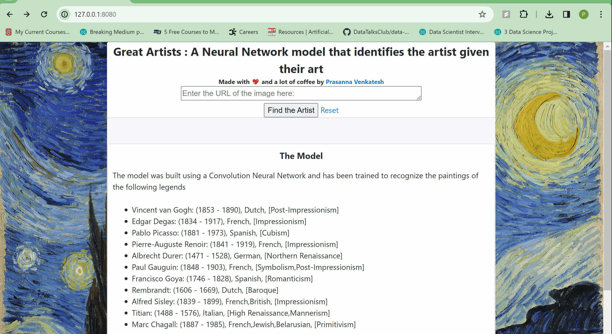

# GreatArtists
Building a Neural Network model to identify the artist given their art.

The website is currently hosted on Render. 
Link: https://great-artists.onrender.com/.
If you do encounter any server errors, please do let me know at prasannav710@gmail.com (Render does not provide much resources in the free tier, and me being a broke college student can't afford to pay for hosting, yet). I will figure out a way to provide a live demo if interested.

The model was built using a Convolution Neural Network and has been trained to recognize the paintings of the following legends:

- Vincent van Gogh: (1853 - 1890), Dutch, (Post-Impressionism)
- Edgar Degas: (1834 - 1917), French, (Impressionism)
- Pablo Picasso: (1881 - 1973), Spanish, (Cubism)
- Pierre-Auguste Renoir: (1841 - 1919), French, (Impressionism)
- Albrecht Durer: (1471 - 1528), German, (Northern Renaissance)
- Paul Gauguin: (1848 - 1903), French, (Symbolism,Post-Impressionism)
- Francisco Goya: (1746 - 1828), Spanish, (Romanticism)
- Rembrandt: (1606 - 1669), Dutch, (Baroque)
- Alfred Sisley: (1839 - 1899), French,British, (Impressionism)
- Titian: (1488 - 1576), Italian, (High Renaissance,Mannerism)
- Marc Chagall: (1887 - 1985), French,Jewish,Belarusian, (Primitivism)

Thank you for taking the time to check out the website!
